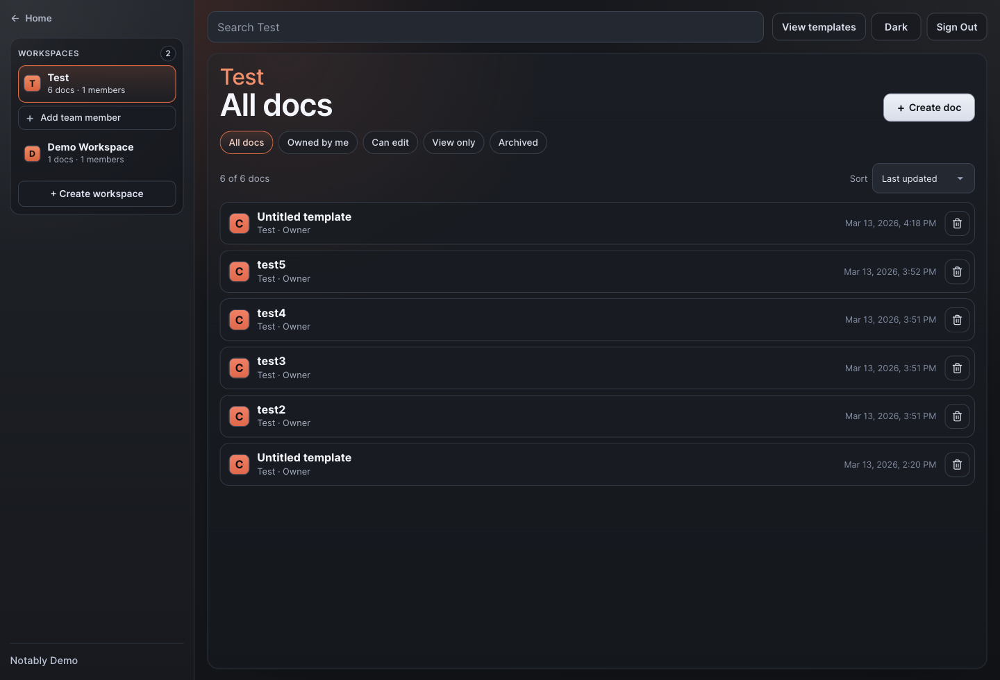
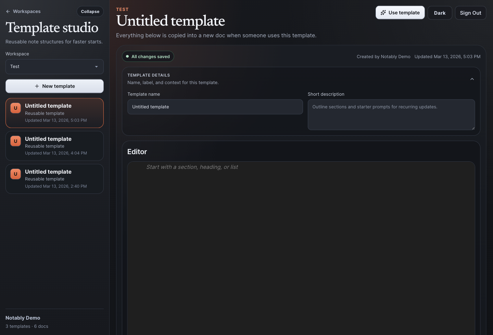

# Notably

Notably is a local-first collaborative notes app for teams that need clear structure, controlled sharing, and realtime collaboration without messy handoffs.

## What It Does

- Workspace-based note organization
- Per-note permissions with `OWNER`, `EDITOR`, and `VIEWER` roles
- Realtime collaborative editing with Liveblocks + Yjs
- Note-level chat and viewer chat controls
- Reusable note templates
- Note archiving
- Public marketing pages, including a screenshot-backed `See How It Works` walkthrough

## Stack

- Next.js App Router
- TypeScript
- Prisma
- SQLite
- Liveblocks
- Yjs
- BlockNote

## Screens





## Local Setup

1. Install dependencies.

```bash
npm install
```

2. Copy environment variables.

```bash
cp .env.example .env
```

3. Generate the Prisma client.

```bash
npx prisma generate
```

4. Push the schema into the local SQLite database.

```bash
npx prisma db push
```

5. Seed the demo user and starter workspace.

```bash
npm run db:seed:demo
```

6. Start the app.

```bash
npm run dev
```

Open [http://localhost:3000](http://localhost:3000).

## Demo User

Default demo credentials from the seed script:

- Email: `demo@notably.app`
- Password: `DemoPass123!`

These can be overridden with the demo env vars in [`.env.example`](.env.example).

## Environment Variables

- `DATABASE_URL`
- `LIVEBLOCKS_SECRET_KEY`
- `SESSION_TTL_DAYS`
- `APP_URL`
- `RESEND_API_KEY`
- `RESEND_FROM_EMAIL`
- `NEXT_PUBLIC_DEMO_USER_EMAIL`
- `NEXT_PUBLIC_DEMO_USER_PASSWORD`
- `DEMO_USER_EMAIL`
- `DEMO_USER_PASSWORD`
- `DEMO_USER_NAME`
- `DEMO_WORKSPACE_NAME`
- `DEMO_NOTE_TITLE`

## Useful Scripts

```bash
npm run dev
npm run build
npm run start
npm run lint
npm run db:seed:demo
```

## Data Model

Core Prisma models:

- `User`
- `Session`
- `Workspace`
- `WorkspaceMember`
- `Note`
- `NoteTemplate`
- `NotePermission`
- `NoteMessage`
- `NoteSnapshot`

Schema source: [`prisma/schema.prisma`](prisma/schema.prisma)
